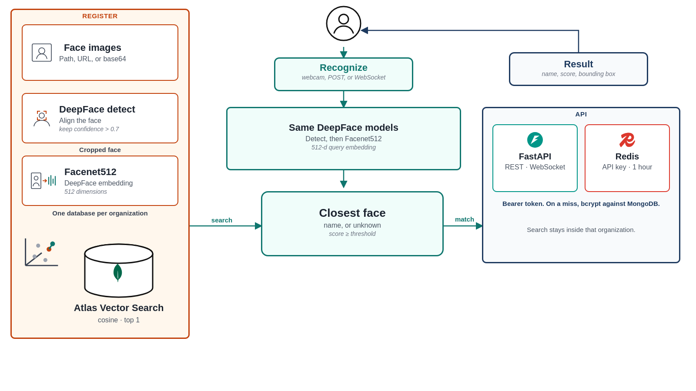

# Face API

Facial recognition API. An image goes through DeepFace for detection and a Facenet512 embedding, then MongoDB Atlas Vector Search returns the closest stored face inside one organization.



## Flow

Registration (`POST /register/{organization}`):

1. DeepFace detects faces and aligns them. Detections with confidence at or below 0.7 are dropped.
2. Facenet512 embeds each cropped face. The vector has 512 dimensions.
3. The vector is stored in that organization's `embeddings` collection.

Recognition (`POST /recognize/{organization}` or `ws://host/ws/recognize`):

1. The same detector and embedder run on the query image.
2. Atlas Vector Search compares it with cosine similarity (`exact: false`, 20 candidates, limit 1).
3. If the Atlas score is below the request threshold, the name is `unknown`. The JSON field for that score is `distance`. The response also includes the bounding box. Cropped face pixels are removed before it is sent.

Both calls require a Bearer API key. Redis stores a valid key for one hour. On a cache miss the key is checked with bcrypt against the organization's `api_keys` collection.

Each organization is its own MongoDB database, with `embeddings` and `api_keys`. Creating an organization also creates the vector index `face_embbedings`.

The detector backend and embedder model come from the environment. The code defaults are `yolov8` and `Facenet512`. `.env.example` and the Cloud Run workflow use `ssd` and `Facenet512`.

## Stack

- FastAPI and Uvicorn
- DeepFace for detection and embedding
- MongoDB Atlas Vector Search
- Redis for API-key cache
- React, Vite, and TypeScript demo in `ui/` (webcam over HTTP or WebSocket)
- CPU Docker image. Compose also starts Redis. A GitHub Action can build that image and deploy it to Cloud Run (`europe-west1`, 2 CPU, 2 GiB, max 1 instance).

## API

`POST /orgs` and `POST /orgs/{organization}/api-key` are open. The other routes need `Authorization: Bearer <api_key>`, plus `user` and `api_key_name` (in the JSON body as `api_auth`, or as query parameters on GET).

```http
POST /orgs
{ "organization": "org_name" }

GET /orgs

POST /orgs/{organization}/api-key
{ "user": "username", "api_key_name": "key_name" }

DELETE /orgs/{organization}/api-key
{ "api_auth": { "user": "username", "api_key_name": "key_name" } }

POST /register/{organization}
{ "images": ["path", "https://...", "base64..."], "name": "person_name", "api_auth": { "user": "username", "api_key_name": "key_name" } }

POST /recognize/{organization}
{ "image": "path or base64", "threshold": 0.5, "api_auth": { "user": "username", "api_key_name": "key_name" } }

GET /people/{organization}?user=username&api_key_name=key_name

DELETE /people/{organization}
{ "name": "person_name", "api_auth": { "user": "username", "api_key_name": "key_name" } }
```

WebSocket: `ws://host/ws/recognize?token={api_key}&organization={org}&user={user}&api_key_name={name}`

Each message is `{ "image": "...", "threshold": 0.5, "organization": "org_name" }`.

Swagger is at `/docs` when the server is running.

## Run

```bash
git clone https://github.com/samuellimabraz/face-api.git
cd face-api
cp .env.example .env
```

Set `MONGODB_URI`. For Compose, `REDIS_HOST` should be `redis`. For a local process talking to the Compose Redis, use `localhost`.

```bash
docker compose -f docker/docker-compose.yaml up --build
```

The API listens on port 8000. The image is CPU-only (`docker/Dockerfile.cpu`).

Without Docker:

```bash
pip install -r requirements-cpu.txt
PYTHONPATH=. uvicorn src.api.main:app --host 0.0.0.0 --port 8000
```

Demo UI (proxies `/api` to `http://127.0.0.1:8000`; the WebSocket client connects to `ws://localhost:8000` directly):

```bash
cd ui
npm install
npm run dev
```

## Layout

```
src/api/                  FastAPI routes and API-key auth
src/services/             detection, embedding, and database calls
src/domain/               models and interfaces
src/infrastructure/ml/    DeepFace detector and embedder
src/infrastructure/database/  MongoDB
ui/                       React demo
docker/                   CPU image and Compose
```
